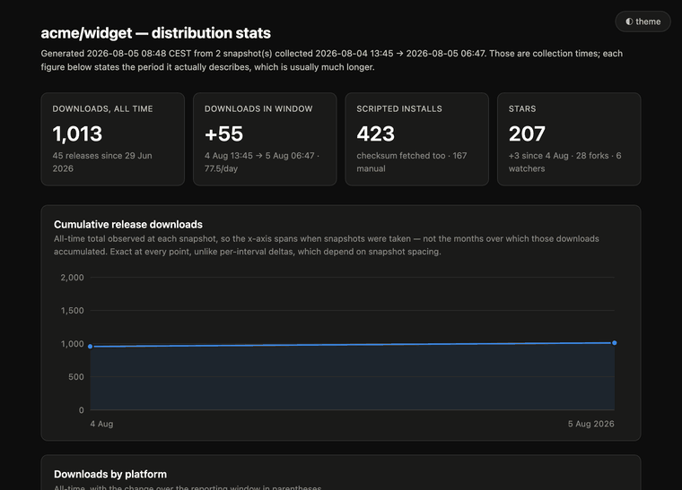

# git-stats

Local, over-time metrics for how any GitHub repository is actually being downloaded.

## Why this exists

GitHub does expose distribution numbers, but not as history:

- **Release asset downloads** are a single cumulative counter per asset. There is no
  "downloads last week" — only "downloads ever". A trend exists only if something
  writes the counter down repeatedly.
- **Traffic data** (views, clones, referrers, popular paths) is kept for **14 days**
  and then deleted. A day not captured inside that window is gone permanently.

So this tool snapshots those endpoints, archives every raw response, and derives
trends from the archive. Everything stays on your machine — there is no service,
no account and no telemetry.

## What it looks like

One command takes a snapshot, the other says where things stand:


`report -html` writes the same numbers as a self-contained dashboard — one file,
no external requests, opens straight from disk:



Both recordings run against a synthetic dataset: `acme/widget` is not a real
repository, and none of those figures are anybody's real traffic. Views, clones,
referrers and paths are owner-only analytics, so a README is the wrong place for
a real one.

## Install

```sh
curl -fsSL https://raw.githubusercontent.com/dejo1307/git-stats/main/install.sh | sh
```

Installs the latest release into `$HOME/.local/bin`, verifying the published
SHA-256 checksum before it does. Set `GIT_STATS_INSTALL_DIR` to install elsewhere,
or `GIT_STATS_VERSION` to pin a version. Linux, macOS (Intel and Apple Silicon) and
Windows via Git Bash / MSYS2 are all covered.

Prefer to build it yourself, or want a platform the releases don't cover:

```sh
go install github.com/dejo1307/git-stats/cmd/git-stats@latest
```

Binaries for every platform are also attached to each
[release](https://github.com/dejo1307/git-stats/releases) as
`git-stats-<version>-<os>-<arch>.tar.gz`, each with a `.sha256` beside it.

## Quick start

```sh
cp .env.example .env && chmod 600 .env
$EDITOR .env             # set GIT_STATS_REPO=owner/name

git-stats collect        # take a snapshot
git-stats report         # see where things stand
```

`collect` works with no token at all for release counters. To get traffic data you
need a credential — see below.

## Configuration

Everything is configured through environment variables, which may equally live in a
`.env` file next to the binary, in the working directory, or wherever `-env` points.
**Real environment variables always win** — `.env` supplies defaults only, so a one-off
`GIT_STATS_REPO=other/repo git-stats collect` still overrides the file.

| Variable | Meaning |
|---|---|
| `GIT_STATS_REPO` | **Required.** Repository to track, as `owner/name`. `-repo` overrides it. |
| `GIT_STATS_TOKEN` | API token. Falls back to `GH_TOKEN`, then `GITHUB_TOKEN`. |
| `GIT_STATS_ASSET_PREFIX` | Release asset filename prefix. Defaults to the repository name. |
| `GIT_STATS_TRACK_PATHS` | Comma-separated paths whose commit history is captured, so changes to them can be lined up against the numbers. Defaults to `README.md`; a trailing slash tracks a directory. |
| `GIT_STATS_DIR` | Data directory holding `raw/` and `stats.db`. Defaults to `./data`. |
| `GIT_STATS_API_BASE` | API host. Defaults to `https://api.github.com`; set it to `https://HOST/api/v3` for GitHub Enterprise Server. |

There is deliberately no default repository: an unset `GIT_STATS_REPO` is an error
rather than a silent fallback, so a misconfigured run cannot quietly archive
somebody else's numbers.

### Tracking several repositories

One binary, one configuration file per repository, each naming its own data
directory. `-env` selects which:

```
~/stats/
  acme-widget.env      GIT_STATS_REPO=acme/widget
                       GIT_STATS_DIR=/Users/me/stats/acme-widget
                       GIT_STATS_TOKEN=…
  acme-gadget.env      GIT_STATS_REPO=acme/gadget
                       GIT_STATS_DIR=/Users/me/stats/acme-gadget
                       GIT_STATS_TOKEN=…
  acme-widget/         raw/  stats.db
  acme-gadget/         raw/  stats.db
```

```sh
git-stats collect -env ~/stats/acme-widget.env
git-stats collect -env ~/stats/acme-gadget.env
git-stats report  -env ~/stats/acme-gadget.env -html gadget.html
```

`-env` works on every command and is read before anything else, since it is what
supplies the defaults every other flag falls back to. Flags still override it, so
`-data` or `-repo` can redirect a single run without editing the file.

**Set `GIT_STATS_DIR` in every one of them.** It is the only thing keeping two
repositories in two archives. Without it both runs default to `./data` relative to
wherever you are standing, and one snapshot series ends up holding one repository's
releases beside another's traffic — a mixture no `rebuild` can take apart afterwards,
because the archive it replays is already wrong. `collect` warns when `-env` is used
and no data directory is configured.

Two smaller guarantees in the same spirit: a `-env` file that does not exist is an
error rather than a quiet fall back to whichever `.env` is nearby, and the token is
resolved per file, so each repository can carry a credential scoped to itself.

Nothing about a data directory is tied to a checkout of this repository — it is just
`raw/` and `stats.db`. Keeping the archives somewhere central, as above, tends to age
better than one `data/` per project clone.

### Release asset names

The per-platform breakdown comes from asset filenames, which GoReleaser and
hand-rolled release workflows converge on:

```
<prefix>-<version>-<goos>-<goarch>.<tar.gz|tgz|tar.xz|tar.bz2|zip|sha256|sha512>
```

The prefix defaults to the repository name, so `owner/widget` publishing
`widget-1.2.3-darwin-arm64.tar.gz` needs no configuration. Set
`GIT_STATS_ASSET_PREFIX` if your project publishes under a different name.

Assets that do not match are **still counted** — their downloads land in the totals,
just without an OS, arch or kind. So a project with entirely different naming still
gets working download trends, only without the platform charts.

## Token setup

| Data | Credential needed |
|---|---|
| Release downloads, repo counters | none (unauthenticated is fine, 60 req/h) |
| Views, clones, referrers, paths | **classic** PAT with the `public_repo` scope |
| Star history backfill | a credential the `/stargazers` endpoint accepts |
| Stargazer profiles | any token — **unauthenticated returns every email as null** |

Traffic data is owner-only: the token must belong to an account with push access to
the repository you are tracking.

**The Traffic API does not accept fine-grained tokens.** A fine-grained PAT holding
the `administration=read` permission that those endpoints advertise as their
requirement is still refused with *"Resource not accessible by personal access
token"* — verified with the same token succeeding on other `administration=read`
endpoints such as `/actions/permissions`. No permission checkbox fixes it; the
endpoint only honours classic tokens.

Create one at **Settings → Developer settings → Personal access tokens → Tokens
(classic) → Generate new token (classic)** and tick a single scope:

- **`public_repo`** — enough for a public repository. Use the broader `repo` scope
  only if you point this at a private one.

Then put it in `.env` as `GIT_STATS_TOKEN`. `.env` is gitignored, and is read from
the working directory or failing that from the directory holding the binary, so the
tool finds it however you invoke it.

Every `collect` prints which variable supplied the token and whether it came from
`.env` or the environment — when the traffic endpoints 403, the usual cause is a
broadly-scoped fallback `GH_TOKEN` being picked up instead of the dedicated one.

A run that cannot reach the traffic endpoints still succeeds — it captures releases
and prints a warning naming the missing permission. Release counters are cumulative
and can be caught up at any time; traffic cannot.

## Commands

```
git-stats collect [-repo R] [-data DIR] [-stars] [-forks] [-users] [-track PATHS]
git-stats report  [-repo R] [-since 30d] [-per-day] [-html FILE]
git-stats rebuild [-repo R] [-data DIR]
git-stats backfill [-repo R] [-data DIR]
git-stats backfill-stars [-repo R] [-data DIR]
git-stats backfill-users [-repo R] [-data DIR] [-user-refresh 30d]
git-stats version
```

Every command also takes `-env FILE` to read configuration from a named file — see
[Tracking several repositories](#tracking-several-repositories).

- `report -html stats.html` writes a self-contained dashboard — no external requests,
  works opened straight from disk, light and dark.
- `rebuild` deletes the database and replays the whole archive into a new one. It
  takes `-repo` even though it fetches nothing, because replaying re-derives the
  per-platform columns from asset filenames.
- `backfill` fetches every history that dates itself — stars, forks, and the diff size of
  each commit touching a tracked path — plus the public profile of every stargazer. The
  first three are complete back to the first commit, so this is worth running once rather
  than repeatedly; the per-commit half is cached permanently, since a commit cannot change.
- `backfill-stars` is the star history on its own.
- `backfill-users` is the stargazer profiles on their own. See below.

### Stargazer profiles

`backfill-users` fetches each stargazer's public profile — the name, company, location,
website and, where the account publishes one, the profile email. It is the only crawl
here priced per person: one request per account against an hourly budget of 5000, where
every other endpoint costs one request for the whole repository.

Two things keep that affordable. Profiles are cached in `raw/users/`, outside the
timestamped snapshots, so an account is fetched once and skipped by every later run; and
`-user-refresh 30d` re-checks aged copies with the stored ETag, which GitHub answers
`304 Not Modified` and does not charge against the rate limit at all. So the price is one
request per *new* stargazer, paid once. Running out of budget mid-crawl is not a failure
— it warns, says how many accounts it did not reach, and the next run resumes there.

Three limits are worth knowing before running it:

- **Your own repositories only.** GitHub no longer serves the stargazer list for a
  repository you do not own: `/stargazers` answers `404` to a token without push access
  and `401` unauthenticated, while GraphQL reports the star *count* alongside an empty
  list. There is no credential that lifts this.
- **A token is required for emails.** Unauthenticated the endpoint still answers `200`
  and still returns the profile — with `email` always `null`. So an unauthenticated crawl
  does not fail, it just reports every account as publishing no address. `collect` warns
  when that happens.
- **Most people publish no email.** The profile email is opt-in. Measured over 98 active
  contributors to a large Go project — a generous proxy for stargazers — 94% had a name,
  77% a location, 52% a company, 46% a website and 38% an email. Expect the last figure
  to be lower for a random stargazer list.

Everything collected is what GitHub shows any signed-in visitor on the profile page.
Nothing is inferred, and commit author addresses — which people frequently never meant to
publish — are deliberately not touched.

> GitHub's Acceptable Use Policies, §7: *"You may not use information from the Service
> (whether scraped, collected through our API, or obtained otherwise) for spamming
> purposes, including for the purposes of sending unsolicited emails to users or selling
> personal information, such as to recruiters, headhunters, and job boards."* Asking a
> handful of users what they think of something they starred is not that; mailing the
> list is. In the EU, unsolicited commercial email to individuals additionally needs
> prior consent — in Germany under UWG §7.

## Data layout

```
.env                           configuration and token, gitignored
.env.example                   template, committed
data/
  raw/2026-08-04T07-02-47Z/    immutable archive — the source of truth
    releases.json  repo.json  views.json  clones.json  paths.json  referrers.json
    stargazers.json  forks.json  commits-README.md.json
  raw/commits/<sha>.json       per-commit diff sizes, shared by every snapshot
  raw/users/<login>.json       stargazer profiles, shared by every snapshot
  stats.db                     derived, disposable, rebuildable
```

`commits-<path>.json` names its own path inside the file, so replaying an archive does
not depend on `GIT_STATS_TRACK_PATHS` still holding the value it had at capture time —
change what you track and the old histories keep meaning what they meant. The
`raw/commits/` cache sits outside the timestamped directories because a commit is
immutable: one fetch is good forever, however many snapshots later refer to it.

`raw/users/` sits outside them for the same sharing reason, but a profile is not
immutable the way a commit is, so each record wraps the response in an envelope naming
when it was fetched and under which ETag. That state lives in the archive rather than in
the database, so a `rebuild` restores the cache's freshness too — deleting `stats.db`
still costs derive time and nothing else.

Both `collect` and `rebuild` write to the database through the same ingest path, so a
rebuild reproduces exactly what collection produced. The database is safe to delete;
the archive is not. A file is simply absent when that endpoint was unavailable.

**Committing `data/raw/` is worth considering.** GitHub deletes traffic data after 14
days, so those files become the only copy that will ever exist — version control is the
backup. The archive compresses about 95% (consecutive `releases.json` are nearly
identical), which works out to roughly 15 MB per year of daily collection. `stats.db` is
derived and never needs committing.

> **Only in a private repository, though:** views, clones, referrers and paths are
> owner-only analytics of whatever you are tracking, and committing them publishes them.
> This repository ignores its own `/data/` for exactly that reason — it is public, so
> the numbers in the gifs above come from a synthetic dataset rather than a real
> archive.

## Querying it directly

```sh
sqlite3 data/stats.db
```

```sql
-- Downloads per platform as of the latest snapshot
SELECT os || '-' || arch AS platform, SUM(download_count) AS total
FROM asset_count
WHERE snapshot_id = (SELECT MAX(id) FROM snapshot)
GROUP BY platform ORDER BY total DESC;

-- Growth of one release between the two most recent snapshots
SELECT a.release_tag, SUM(a.download_count) - SUM(b.download_count) AS delta
FROM asset_count a JOIN asset_count b ON a.asset_id = b.asset_id
WHERE a.snapshot_id = (SELECT MAX(id) FROM snapshot)
  AND b.snapshot_id = (SELECT MAX(id) FROM snapshot WHERE id < (SELECT MAX(id) FROM snapshot))
GROUP BY a.release_tag HAVING delta > 0 ORDER BY delta DESC;

-- Merged daily traffic (only days captured inside the 14-day window exist)
SELECT day, count, uniques FROM traffic_day WHERE metric = 'clones' ORDER BY day;

-- New stars per day next to what shipped that day
SELECT d.day, d.stars, COALESCE(r.tags, '') AS released, COALESCE(c.subjects, '') AS wrote
FROM (SELECT substr(starred_at, 1, 10) AS day, COUNT(*) AS stars
      FROM stargazer GROUP BY day) d
LEFT JOIN (SELECT substr(published_at, 1, 10) AS day, GROUP_CONCAT(tag, ' ') AS tags
           FROM release GROUP BY day) r ON r.day = d.day
LEFT JOIN (SELECT substr(committed_at, 1, 10) AS day, GROUP_CONCAT(subject, '; ') AS subjects
           FROM file_change GROUP BY day) c ON c.day = d.day
ORDER BY d.stars DESC LIMIT 20;
```

Tables: `snapshot`, `asset_count`, `traffic_day`, `traffic_window`, `traffic_top`,
`repo_stat`, `stargazer`, `stargazer_profile`, `fork`, `release`, `file_change`,
`backfill`. The schema is documented inline in
[internal/store/store.go](internal/store/store.go).

`stargazer_profile` is joined to `stargazer` on `login`, and a stargazer with no row
there has not been fetched — which is different from an account that publishes nothing,
whose row exists with NULLs in it:

```sql
SELECT s.login, s.starred_at, p.name, p.email, p.company, p.location
FROM stargazer s LEFT JOIN stargazer_profile p USING (login)
WHERE p.email IS NOT NULL
ORDER BY s.starred_at DESC;
```

## What is and isn't retroactive

Only one of these datasets starts from zero the day you begin collecting:

| Data | On your very first run | Afterwards |
|---|---|---|
| Release download counts | **All-time totals**, back to each asset's upload | trends accrue from your first snapshot |
| Views / clones / referrers / paths | **The previous 14 days**, daily buckets | window slides; miss >14 days and those days are gone |
| Stars / forks / watchers | current values only | trend accrues from your first snapshot |
| Star history | fully retroactive — every star carries its own date | complete after one backfill |
| Fork history | fully retroactive — every fork carries its creation date | complete after one backfill |
| Stargazer profiles | current values only — a profile has no history anywhere | one request per new stargazer, cached |
| Release dates | fully retroactive — back to the first release | every collection re-confirms them |
| Tracked-path commits | fully retroactive — back to the first commit | one cheap request per path, every run |

So the 14-day limit is not "14 days from when you start" — the first call already
hands you the preceding fortnight. The constraint is on the *gap between runs*: as
long as you never go more than 14 days without collecting, the daily series stays
continuous indefinitely, and `traffic_day` accumulates it forever.

Release counters behave the opposite way: the all-time total is available instantly
and is never lost, but the *history* of how it got there does not exist and can only
be built forward from your first snapshot.

## Lining events up against the numbers

Every time chart carries markers for two kinds of event: a release, and a commit
touching a tracked path — `README.md` by default, configurable with
`GIT_STATS_TRACK_PATHS`. Both are retroactively complete, so the markers reach back to
the project's first commit whether or not you were collecting at the time.

The dashboard adds two views built on them. **What each event did** compares new stars
per day in the seven days before an event against the seven days from it onward. Stars
are used because their history is the only complete one here; views and clones exist
only for days captured inside the 14-day window, so for most events there is nothing on
the other side of the comparison to look at. **By week** aggregates releases, tracked
changes and arrivals into ISO weeks.

Two things the tables do rather than paper over:

- **They refuse.** A window whose two sides were not both observed for at least 60% of
  their days prints `insufficient data` with the coverage, instead of a ratio computed
  over whichever days happened to survive.
- **They name the neighbours.** Any other event inside the same window is listed. If you
  ship every other day, *every* row will carry them, and the honest reading is that no
  single release is separable — which is what the weekly table is for.

Nothing here establishes cause. There is no control period, no correction for the day of
the week, and no sight of the thing that most often moves these numbers: somebody else
linking to you. The referrer table is the only window onto that, and it covers 14 days.

## How to read the numbers

- **Deltas are between snapshots, not per day.** Collection is manual, so intervals are
  irregular. The report always labels the interval it measured; `-per-day` normalises.
- **Unique visitors never sum.** Daily buckets each count a returning visitor again, so
  adding them up overcounts — one real archive's first window reported 248 uniques where
  the daily figures summed to 306. The de-duplicated number is stored per snapshot in
  `traffic_window` and is the only one the report quotes as "unique".
- **The first snapshot is a baseline.** Its counters are all-time totals that cannot be
  attributed to any date, so no interval is derived from it.
- **Counters never go down.** A decrease means an asset was replaced or a release
  deleted, so it contributes zero rather than a negative.
- **An asset first seen in a later snapshot contributes its whole count** — it was
  created inside that interval, so everything it accrued belongs there.
- **A platform reading zero may mean nothing was published for it**, not that nobody
  wants it. Check that the release actually carries that asset before concluding
  anything about demand.
- **Install scripts and self-updaters fetch an artifact and its checksum together**; a
  browser download usually fetches only the artifact. The smaller count approximates
  scripted installs, the excess approximates manual ones. This split only appears for
  projects that publish a checksum per artifact.
- **A self-update cannot be told apart from a fresh install.** A self-updater issues
  exactly the same asset requests as a first-time install script, and GitHub's
  `download_count` records no user agent, referrer or IP. Upgrades are therefore
  counted, but only inside the combined "scripted" figure.
- **Clones and release downloads do not overlap.** They count disjoint distribution paths:
  cloning and source-level package managers fetch no release asset, while install
  scripts, self-updaters and browser downloads never clone. Clones running many times
  higher than the all-time download total is expected and is not evidence that either
  figure is wrong.
- **Source installs have no download counter anywhere,** and clone count is a weak
  stand-in in both directions: a module or package proxy caches each version globally,
  so many installs can produce a single clone, while CI, mirrors and scanners inflate
  the same number. Never read clones as a user count.
- **Counts include bots** — mirrors, scanners and CI all download releases, and GitHub
  does not separate them out.
- **A star history rebuilt from the stargazer list is the stars that survived.** The list
  holds only people who still star the repository, so anyone who starred and later
  unstarred is absent from every past date too. Where the counter captured at the
  earliest snapshot disagrees with the rebuilt history, the dashboard says so and by how
  much. Fork history has the same blind spot for deleted forks.
- **A dash in the weekly table is not a zero.** It marks a week outside that column's
  coverage — mostly traffic, before collection began.

## What none of this measures

Every figure here is an **acquisition event**. Nothing in it reports usage, retention or
whether anyone ran your software twice.

- **A `git pull` is not a clone.** Clone traffic counts full clone operations; pulling into
  an existing checkout is an incremental fetch and is never counted. Someone who cloned once
  in June and has pulled daily since contributes nothing to today's clone count. GitHub
  exposes no fetch or pull metric at all.
- **CI re-acquires constantly.** `actions/checkout` performs a fresh clone on every run, so a
  single active workflow can outweigh many real developers in the same number.
- **Downloads are one-shot too.** An artifact download says someone installed that version
  once. It says nothing about whether it was ever run, kept, or replaced.

The practical consequence: these numbers track how many people *obtain* your project, and
are biased upward by automation and downward by caching. They are not a user count and
cannot become one without adding opt-in telemetry to the project itself, which is a
separate decision with its own tradeoffs.

## Scheduling

Collection is manual by design. If you want it automatic, a launchd agent or a systemd
timer calling `collect` once a day is enough — and unlike cron, launchd fires on wake if
the machine was asleep at the scheduled time. For several repositories, one unit per
`-env` file: they touch different data directories, so they can equally run in
sequence or at once. Until then: any traffic day not captured
within 14 days is lost, while release download counts are cumulative and never lost.

## Releases and CI

Tagging `v*` builds and publishes every platform:

| | amd64 | arm64 |
|---|---|---|
| Linux | ✓ | ✓ |
| macOS | ✓ (Intel) | ✓ (Apple Silicon) |
| Windows | ✓ | ✓ |

All six are **cross-compiled from a single Linux runner** with `CGO_ENABLED=0`,
which is possible because the only heavyweight dependency — `modernc.org/sqlite` —
is a pure-Go SQLite.

That is a deliberate choice rather than a convenience. `macos-13` is GitHub's last
Intel macOS runner and it is being retired; any release workflow that builds
darwin/amd64 on a native Intel runner stops producing Intel Mac binaries the day
that image disappears, and Intel users silently lose their download. Cross-compiling
has no such dependency, and the release job asserts each binary's actual
architecture with `file` before publishing, so a silent fallback to the host
architecture fails the build instead of shipping a mislabelled binary.

Release assets follow the same `<prefix>-<version>-<os>-<arch>.<ext>` scheme
git-stats parses, so it can track its own releases with no configuration. And
because [install.sh](install.sh) fetches each artifact's `.sha256` alongside it,
git-stats' own "scripted installs" figure means what it claims to.

[install.sh](install.sh) is POSIX `sh`, deliberately — no bashisms and no
`set -o pipefail`. A piped script never honours its own shebang; the interpreter
on the left of the pipe runs it, and on Debian and Ubuntu that is dash, which
rejects `pipefail` outright. A bash-only installer dies on `| sh` before it does
any real work, on the most common Linux systems there are.

CI on every pull request runs tests with the race detector, the same six-target
cross-build, `golangci-lint`, `govulncheck`, and an architectural regression gate
powered by [enola](https://github.com/enola-labs/enola) — which pins a baseline
from the PR's merge base and grades what the change did to the structure. The
architecture job is **advisory**: it reports a verdict into the job summary and
never blocks. To make it enforcing, delete the `exit 0` at the end of its "Grade
the change" step.

## License

[MIT](LICENSE) © Dejan Menges
